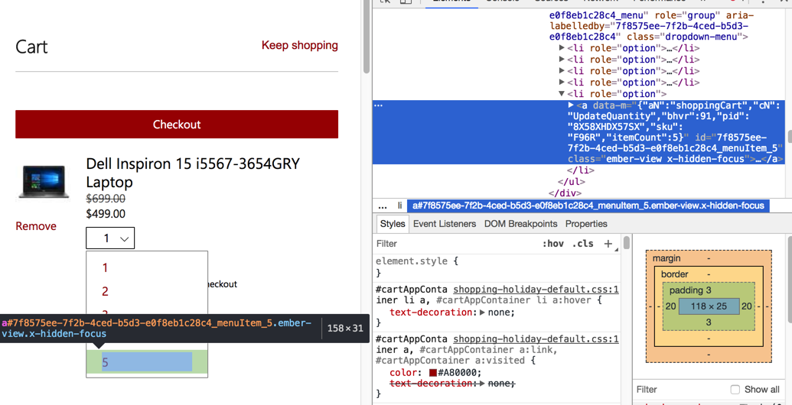

# 场景和举例

下面就来介绍一下XPath的常见使用场景和具体的示例。

## XPath常见使用场景
比如之前自己就遇到过的：
* docbook的xml的处理中的XSLT中使用xpath
* beautifulsoup中的html的提取
* selenium中元素的选择
* scrapy的Selector中提取内容

## XPath使用举例

TODO：
1.把selenium相关的帖子中的示例代码，尤其是关于xpath的，整理过来供参考

### 常见符号和属性判断

#### `@属性`举例
对于判断元素中是否包含某个属性（注意不是去判断属性的值），则语法是：`[@someProperty]`

比如：
```html
<span aria-label="Price" class="x-hidden-focus">$799.00</span>
```
和
```html
<div class="price-text srv_price">
    <s class="srv_saleprice" aria-label="Full price was $1,699.00">$1,699.00</s>
    <span>&nbsp;</span>
    <div class="price-disclaimer ">
        <span aria-label="Now $1,299.00" class="x-hidden-focus">$1,299.00</span>
    </div>
</div>
```

只想要判断spand中存在aria-label属性即可，则可以用：`//span[@aria-label]`

更多例子如下：

* `@class="dropdown-menu"`
    * `cartNumOptionElemList = driver.find_elements_by_xpath('//ul[@class="dropdown-menu"]/li[@role="option"]')`
* `@name="loginfmt"`
    * `inputEmailElement = WebDriverWait(driver, gCfg["waitTimeout"]).until(
    EC.presence_of_element_located((By.XPATH, '//input[@type="email" and @name="loginfmt"]')))`
* `@id="idSIButton9"`
    * `nextElement = driver.find_element_by_xpath('//input[@type="submit" and @id="idSIButton9" and @value="Next"]')`

#### selenium中特殊列表元素的选择
之前遇到列表选项的html不是`select`的`option`，而是：
```html
<ul id="22bc22dd-ef9d-4d3c-8de9-1e7bc704f9f9_menu" role="group" aria-labelledby="22bc22dd-ef9d-4d3c-8de9-1e7bc704f9f9" class="dropdown-menu">
            <li role="option"> 
<a data-m="{&quot;aN&quot;:&quot;shoppingCart&quot;,&quot;cN&quot;:&quot;UpdateQuantity&quot;,&quot;bhvr&quot;:91,&quot;pid&quot;:&quot;8X58XHDX57SX&quot;,&quot;sku&quot;:&quot;F96R&quot;,&quot;itemCount&quot;:1}" id="22bc22dd-ef9d-4d3c-8de9-1e7bc704f9f9_menuItem_1" class="ember-view x-hidden-focus">                          1
                      
</a>            </li>
            <li role="option"> 
...
```
即，`ul`的`li`的列表

最后用代码：
```python
cartNumOptionElemList = driver.find_elements_by_xpath('//ul[@class="dropdown-menu"]/li[@role="option"]')
cartNumOptionCount = len(cartNumOptionElemList)
logging.info("cartNumOptionElemList=%s,cartNumOptionCount=%s", cartNumOptionElemList, cartNumOptionCount)
if cartNumOptionCount < gCfg["msStore"]["onceBuyNum"]:
    logging.error("Current Cart select max number %s < expected select number %s", cartNumOptionCount, gCfg["msStore"]["onceBuyNum"])
    driver.quit()
toSelectIdx = gCfg["msStore"]["onceBuyNum"] - 1
# carNumSelect = Select(cartNumOptionElemList)
# carNumSelect.select_by_index(gCfg["msStore"]["onceBuyNum"])
carNumSelectElem = cartNumOptionElemList[toSelectIdx]
logging.info("carNumSelectElem=%s", carNumSelectElem)
carNumSelectElem.click()
# aLinkElem = carNumSelectElem.find_element_by_link_text(str(gCfg["msStore"]["onceBuyNum"]))
# logging.info("aLinkElem=%s", aLinkElem)
# aLinkElem.click()
```

去实现，找到列表的元素，点击后下拉显示所有的选项，然后点击选中某个选项：




### 常见函数的使用

#### text()函数
* 对于HTML代码：
```html
<a target="_self" href="/s?rsv_idx=1&amp;wd=111&amp;usm=3&amp;ie=utf-8&amp;sl_lang=en&amp;rsv_srlang=en&amp;rsv_rq=en&amp;rqlang=cn">英文结果</a>
```
定位英文结果即可使用：
`//a[text()="英文结果"]`

另外一个例子：
* `clickHereBtnElement = driver.find_element_by_xpath('//a[text()="click here"]')` 中的 `text()="click"`

#### last()函数
* `//input[@name="identity"][last()]`

#### docbook的xml的处理 -》XSLT中使用xpath
```xml
<xsl:key name="book" match="books/book" use="concat(@title, '|', @author)"/>
```

### 逻辑判断

#### not 逻辑非
* `//input[@name="identity" and not (contains(@class,'A'))]`
* `//input[not(@class)]`

#### 不等于 !=
Selenium的Chrome的driver中用xpath去查找元素，是可以通过：
```python
//a[@id="uhf-shopping-cart" and @aria-label!="0 items in shopping cart"]
```
实现判断，只匹配到
```python
id="uhf-shopping-cart" aria-label="2 items in shopping cart"
```
这类元素，而不匹配：
```python
id="uhf-shopping-cart" aria-label=“0 items in shopping cart"
```
即xpath支持：
```python
@someProperty!="some not expected text"
```
这种写法的
